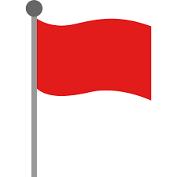
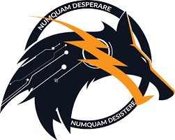
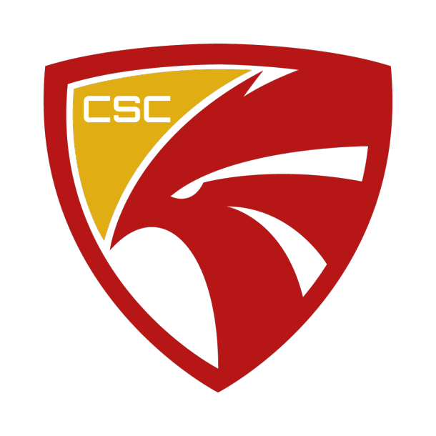
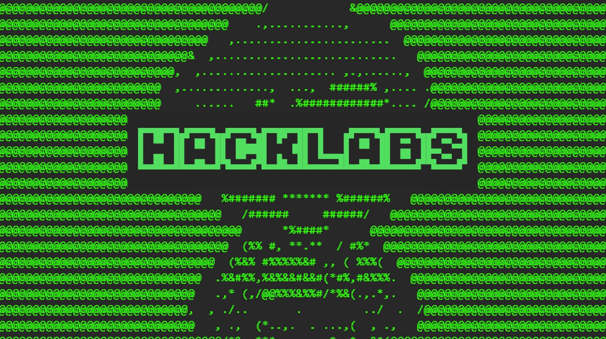
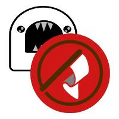

# Hello, peeps !

## I'm Bryan and I usually go by the nickname "Bigby"

I am highly interested in learning cyber security while also giving back to the community and growing as a whole.

---

## How do I continue to learn?

- I play  Capture The Flag (CTF) competitions regularly

- I play  [HackTheBox](https://www.hackthebox.eu/home/users/profile/168660) and  [TryHackMe](https://tryhackme.com/) 

- I like to read and watch a lot of informational articles / videos regarding cyber security

- I like to experiment and learn interesting things regarding digital forensics

---

## What else do I do?

 I am an active member of [Petir Cyber Security](https://petircysec.com/) in the Web Exploitation Stream

 I am currently the Head of Human Capital Division of [Cyber Security Community](https://student-activity.binus.ac.id/csc/) and ocassionally teach in Cyber Classes

 I am one of the founder and problem setter of [HackLabs ID](https://www.instagram.com/hacklabs.id/) , a new Mini CTF using Instagram and [Discord](https://discord.gg/thGvzse) as our platform

 I also develop the Discord Bot "Flag Muncher" as the flag submission and scoring medium in HackLabs' Discord Channel

---

## Where can I be contacted?

You can  [Email Me](mailto:lee.bryanmitchell@gmail.com) or check out my  [LinkedIn](https://www.linkedin.com/in/bryan-mitchell-lee-14b0871b0/)